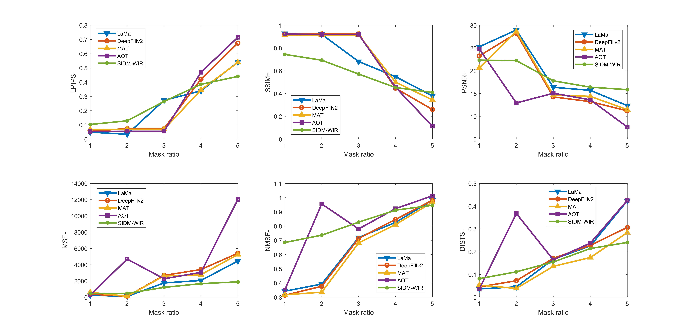

# The-sample-improved-Image-restoration-method-based-on-diffusion-model

[JiaYan Wen], 
[YuanSheng Zhuang](https://github.com/Zhuangvictor0), 
[JunYi Deng], 

 School of Automation, Research Center for Intelligent  Cooperation and Cross-application, Guangxi University of Science and Technology 

Our network is built on the PyTorch framework. The experimental platform is Google Colab, trained on Tesla T4 GPU (15GB) with a batch size of 2, with a learning rate of 2e-6. All the images and masks are cropped to 512x512.
**The trained model and dataset can get from here** [[Dataset & ckpt](https://drive.google.com/drive/folders/1Vveh9jsuXFqhMUOVQw_17PcB92XnXPeL?usp=drive_link)] 

### Some Results

Comparison of LPIPS and SSIM performance under different mask ratios using vairous methods

#### Example of restoration:

The restoration results.

#### Contact
E-mail: zhuangvictor0@gmail.com

#### --- Thanks for your interest! --- ####
